# 🏠 Home Assistant Companion App

Een Electron-gebaseerde companion app voor [Home Assistant](https://www.home-assistant.io/) die je desktop PC als volledig sensorapparaat beschikbaar maakt via **MQTT Discovery** en de **Mobile App webhook API**.


---

## ✨ Features

- **Home Assistant dashboard** als native desktop venster
- **47+ hardware sensoren** automatisch beschikbaar in HA via MQTT Discovery + Webhook
- **Dual-channel updates** — sensoren worden via webhook (primair) én MQTT gepubliceerd
- **Resource-vriendelijk** — native Node.js APIs voor CPU/geheugen/uptime, gestaffelde caching voor dure queries
- **Systeemvak (tray)** — app draait op de achtergrond bij sluiten
- **Instellingen overlay** — configureer alles vanuit de app
- **Automatische cleanup** — verouderde sensoren worden automatisch opgeruimd
- **Last Will & Testament** — HA weet direct wanneer de PC offline gaat
- **Cross-platform** — builds voor Windows, macOS en Linux

---

## 📊 Sensoren

### Systeem

| Sensor | Beschrijving | Voorbeeld |
|---|---|---|
| CPU Temperatuur | Kerntemperatuur (WMI fallback) | `26 °C` |
| CPU Gebruik | Processorbelasting | `23 %` |
| CPU Snelheid | Huidige kloksnelheid | `4.2 GHz` |
| CPU Model | Processortype | `Intel® Core™ i7-12700K` |
| Geheugen Gebruik | Gebruikt / Totaal | `8.3 GB / 16.0 GB` |
| Geheugen Percentage | Geheugenbelasting | `26 %` |
| Swap Gebruik | Swap gebruikt / totaal | `1.2 GB / 4.0 GB` |
| Uptime | Tijd sinds laatste herstart | `2d 7u 45m` |

### Moederbord & BIOS

| Sensor | Beschrijving | Voorbeeld |
|---|---|---|
| Moederbord Fabrikant | Merk van het moederbord | `ASUSTeK COMPUTER INC.` |
| Moederbord Model | Modeltype | `ROG STRIX B660-A` |
| BIOS Versie | Firmwareversie | `1205` |

### GPU

| Sensor | Beschrijving | Voorbeeld |
|---|---|---|
| GPU Model | Videokaart naam | `NVIDIA GeForce RTX 4070` |
| GPU Fabrikant | Chipsetfabrikant | `NVIDIA` |
| GPU VRAM | Videogeheugen | `12288 MB` |
| GPU Driver Versie | Geïnstalleerde driver | `551.23` |
| GPU Temperatuur | Kerntemperatuur (nvidia-smi) | `45 °C` |
| GPU Gebruik | GPU-belasting | `12 %` |

### Opslag (per schijf)

| Sensor | Beschrijving | Voorbeeld |
|---|---|---|
| Schijf Gebruik | Gebruikt / Totaal | `234 GB / 512 GB` |
| Schijf Temperatuur | S.M.A.R.T. temperatuur | `38 °C` |

### Netwerk (per interface)

| Sensor | Beschrijving | Voorbeeld |
|---|---|---|
| Download | Inkomend verkeer | `1250 KB/s` |
| Upload | Uitgaand verkeer | `340 KB/s` |

### Batterij (indien aanwezig)

| Sensor | Beschrijving |
|---|---|
| Batterij Niveau | Percentage |
| Batterij Opladen | Aan het laden (ja/nee) |
| Netstroom Verbonden | Adapter aangesloten (ja/nee) |

### Overig

| Sensor | Beschrijving |
|---|---|
| Besturingssysteem | OS naam |
| OS Versie | Versienummer |
| Hostname | Computernaam |

---

## 🔧 Vereisten

- **Windows 10/11**, **macOS 11+**, of **Linux** (Debian/Ubuntu/Fedora)
- **Home Assistant** met netwerktoegang
- **MQTT Broker** (bijv. [Mosquitto](https://mosquitto.org/))
- **MQTT Integration** geconfigureerd in Home Assistant
- **Long-Lived Access Token** — maak aan via HA Profiel → Beveiligingstokens

---

## 🚀 Installatie

### Vanuit broncode

```bash
# Clone de repository
git clone https://github.com/Fill84/Home-Assistant-Companion-App.git
cd Home-Assistant-Companion-App

# Installeer dependencies
yarn

# Start de app
yarn start
```

### Bouwen als installer

```bash
# Bouw voor je huidige platform
yarn make
```

| Platform | Output | Locatie |
|----------|--------|---------|
| Windows | `.exe` (Squirrel installer) | `out/make/squirrel.windows/` |
| macOS | `.dmg` disk image | `out/make/` |
| Linux | `.deb` / `.rpm` package | `out/make/deb/` of `out/make/rpm/` |

> **Let op:** Cross-platform builds moeten op het doelplatform zelf gedraaid worden. Gebruik bijv. GitHub Actions met een matrix build voor geautomatiseerde multi-platform releases.

---

## ⚙️ Configuratie

Bij de eerste keer starten verschijnt een setup-scherm:

1. **Home Assistant URL** — bijv. `https://homeassistant.local:8123`
2. **Long-Lived Access Token** — uit HA Profiel
3. **MQTT Broker** — IP-adres of hostname van je broker
4. **MQTT Poort** — standaard `1883`
5. **MQTT Gebruikersnaam/Wachtwoord** — optioneel (bij anonymous access)
6. **Update interval** — hoe vaak sensoren worden bijgewerkt (15s–5min)

Na configuratie laadt de app je Home Assistant dashboard en beginnen de sensoren automatisch te publiceren.

---

## 🏗️ Architectuur

```mermaid
graph TD
    subgraph Electron["🖥️ Electron App"]
        Main["main.js"]
        BW["BrowserWindow<br/><i>HA Dashboard</i>"]
        Preload["preload.js<br/><i>IPC Bridge</i>"]
        Tray["System Tray"]
        Settings["Settings Modal"]

        subgraph Sources["src/"]
            Loop["sensor-loop.js<br/><i>Periodieke orchestratie</i>"]
            Sensors["sensors.js"]
            API["ha-api.js"]
            Config["config.js<br/><i>JSON persistentie</i>"]

            subgraph Tier1["⚡ Tier 1 — Native APIs (0 cost)"]
                CPU["os.cpus()"]
                Mem["os.freemem()"]
                Up["os.uptime()"]
            end

            subgraph Tier2["🔄 Tier 2 — si.get() (gestaffelde cache)"]
                GPU["GPU temp / usage"]
                Net["Netwerk stats"]
                Disk["Disk usage / temp"]
                Temp["CPU temp"]
            end
        end
    end

    HA["🏠 Home Assistant<br/><b>47+ sensoren</b>"]
    MQTT["📡 MQTT Broker<br/><i>Mosquitto</i>"]

    Main --> BW
    Main --> Tray
    Main --> Settings
    Main --> Loop
    BW --- Preload

    Loop --> Sensors
    Loop --> API
    Sensors --> Tier1
    Sensors --> Tier2
    Config -.-> Loop

    API -- "Webhook (REST)" --> HA
    API -- "MQTT Publish" --> MQTT
    MQTT -- "MQTT Discovery" --> HA

    style Tier1 fill:#1a3a1a,stroke:#4caf50,color:#fff
    style Tier2 fill:#1a2a3a,stroke:#2196f3,color:#fff
    style HA fill:#1a1a3a,stroke:#03a9f4,color:#fff
    style MQTT fill:#2a1a1a,stroke:#ff9800,color:#fff
```



### Resource-optimalisatie

De sensor collectie is opgedeeld in twee tiers voor minimaal resource-gebruik:

| Tier | Bron | Kosten | Voorbeeld |
|------|------|--------|-----------|
| **Tier 1** | Native Node.js APIs | 0 child processes | CPU usage, geheugen, uptime |
| **Tier 2** | `systeminformation` (gecached) | Alleen bij refresh | GPU temp, netwerk, disk |

Tier 2 data wordt gestaffeld ververst — niet alles tegelijk:

| Data | Refresh interval | Reden |
|------|----------------:|-------|
| Netwerk stats | elke tick | Meest dynamisch |
| CPU temperatuur | elke 2 ticks | WMI subprocess |
| Batterij | elke 2 ticks | Verandert langzaam |
| CPU snelheid | elke 3 ticks | Verandert langzaam |
| GPU (nvidia-smi) | elke 3 ticks | Zwaar subprocess |
| Disk gebruik | elke 6 ticks | Verandert heel langzaam |
| Swap geheugen | elke 6 ticks | Verandert langzaam |
| Disk temperatuur | elke 10 ticks | Verandert heel langzaam |

### MQTT Topics

| Topic | Doel |
|---|---|
| `homeassistant/sensor/<device_id>/<sensor_id>/config` | Discovery configuratie (retained) |
| `<device_id>/sensors` | Sensorwaarden (JSON) |
| `<device_id>/status` | Beschikbaarheid (`online`/`offline`) |

---

## 🖥️ Gebruik

- **Systeemvak** — de app minimaliseert naar het systeemvak bij sluiten
- **Dubbelklik** op het tray-icoon om het venster te tonen
- **Rechtermuisklik** op het tray-icoon voor het contextmenu:
  - *Toon/Verberg Venster*
  - *Instellingen* — open de instellingen overlay
  - *Afsluiten* — sluit de app volledig af

---

## 🛠️ Ontwikkeling

```bash
# Start in development mode
yarn start

# Package zonder installer
yarn package

# Bouw installer voor je huidige platform
yarn make
```

### Projectstructuur

```
├── main.js              # Electron hoofdproces
├── preload.js           # IPC bridge + settings overlay
├── setup.html           # Eerste-keer setup pagina
├── forge.config.js      # Electron Forge build config (cross-platform)
├── package.json
├── assets/
│   ├── icon.ico         # Windows icoon (multi-size: 16–256px)
│   ├── icon.icns        # macOS icoon
│   ├── icon.png         # Basis icoon (256px)
│   └── icon-512.png     # Hoge resolutie icoon (512px)
└── src/
    ├── config.js        # Configuratie opslag (JSON)
    ├── ha-api.js        # MQTT Discovery + Webhook client
    ├── sensors.js       # Hardware sensor collectie (geoptimaliseerd)
    ├── sensor-loop.js   # Periodieke sensor orchestratie
    └── tray.js          # Systeemvak beheer
```

---

## 📝 Waarom MQTT én Webhook?

De app gebruikt **twee kanalen** om sensoren bij te werken in Home Assistant:

1. **Webhook (Mobile App API)** — het primaire kanaal. Registreert het apparaat als `mobile_app` integratie en pusht sensorwaarden via de webhook. Dit is de meest betrouwbare manier om entities in HA bij te werken.

2. **MQTT Discovery** — het secundaire kanaal. Publiceert discovery configs zodat sensoren automatisch verschijnen via de MQTT integratie. Home Assistant filtert standaard alle entiteiten van het `mobile_app` platform uit het **Overzicht dashboard** ([bron](https://github.com/home-assistant/frontend/blob/dev/src/panels/lovelace/strategies/original-states/original-states-strategy.ts)), maar MQTT-entities worden wél getoond.

---

## 📄 Licentie

[MIT](LICENSE) — Phillippe Pelzer

---

## 🙏 Credits

- [Electron](https://www.electronjs.org/)
- [Home Assistant](https://www.home-assistant.io/)
- [systeminformation](https://github.com/sebhildebrandt/systeminformation)
- [MQTT.js](https://github.com/mqttjs/MQTT.js)
- [Mosquitto](https://mosquitto.org/)

